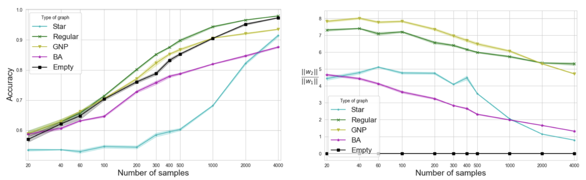

# Graph Neural Networks Use Graphs When They Shouldn’t
Code and datasets for the paper Graph Neural Networks Use Graphs When They Shouldn’t

### Requirements
* Python 3.9
* PyTorch 1.0.0
* PyTorch Geometric 1.0.0
* scikit-learn 0.20.0
* numpy 1.15.4
* scipy 1.1.0
* pandas 0.23.4
* tqdm 4.28.1

### Datasets
The real-world datasets used in the paper are downloaded using Pytorch-Geometric
To recreate the synthetic datasets, run RCOV_synthetic_data.py or different_graph_distributions_exp.py
